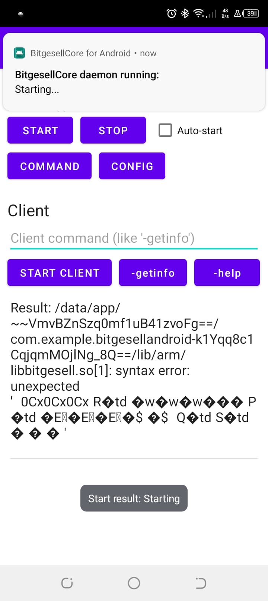

# Bitgesell Android Full Node

Quickly spin upa Bitgesell Node on an Android Device ✨ 


**Minimum Device Requirements**

- A modern Android Device - Android 8.0 (Oreo) and above
- USB Power to keep device on and standby to keep device powered
- At least  8GB available storage to sync a copy of the blockchain and sync blocks from other nodes on the Network

## Getting started

To get started:

Proceed to install and run the installer to setup the Bitgesell Core App on Android Device

OR:

2. Build the Android APK and transfer the `apk` output to Android device and install.

## Building

First you need to build the bitcoin-core binaries for Android. Among common build dependencies you'll need Android Toolchain. Get an Android Studio and download the toolchain using SDK Manager.

First you need to build bitcoin dependencies:
* Apply [this commit](https://github.com/autoconf-archive/autoconf-archive/pull/211/commits/0087595e99c8bb9a41f5c05a426b453c8d4d931c) to ./build-aux/m4/ax_boost_thread.m4.
* Go to 'depends', read README. Choose you Android architecture (aarch64-linux-android and x86_64-linux-android are most common) and run something like:

```sh 
ANDROID_SDK=/home/user/Android/Sdk ANDROID_NDK=/home/user/Android/Sdk/ndk-bundle 

cd bitgesell/depends

make HOST=aarch64-linux-android 

ANDROID_API_LEVEL=28 ANDROID_TOOLCHAIN_BIN=/home/user/Android/Sdk/ndk-bundle/toolchains/llvm/prebuilt/linux-x86_64/bin`
```
- When depends are built, configure bitcoin core to use them:

```sh
./configure --host=aarch64-linux-android --disable-wallet --with-gui=no --prefix=/home/user/bitcoin/depends/aarch64-linux-android`
```

- Then make. What you get is `BGLd` and BGL-cli compiled for your chosen arch.

Now you can build this app with your compiled binaries:
- Clone this repo and cd.
- Create a directory for your chosen architecture. ARCH - one of names from [here](https://developer.android.com/ndk/guides/abis), most commonly arm64-v8a or x86_64.

`mkdir -p app/src/main/jniLibs/$(ARCH)`

NB: `libbitgesell.so` and `libbitgesell-cli` already exist for `arm64-v8a` arch but may cross compile to suit arch needs for target device

- Copy your `BGLd` and `BGL-cli` into the dir created above *under names libbitgesell.so and libbitgesell-cli.so*. This is the only way to force Android Studio to bundle the binaries with the APK.

- Edit module level build.gradle's 'abiFilters' to only include the archs you compiled.

- Build the project. The built apk should will now include your bitcoin core binaries.

## Milestone 2

Fix a errors and sync the blockchain on Android device:



### Notes

1. This is experimental and engergy consumption, Network usage are expected to be be slightly high since the Node will sync the whole blockchain and function as a complete Node.

2.This is work in progress and is being actively work on for improvement

Credits: https://github.com/lndroid/BitcoinCoreAndroid

LICENCE: `MIT`